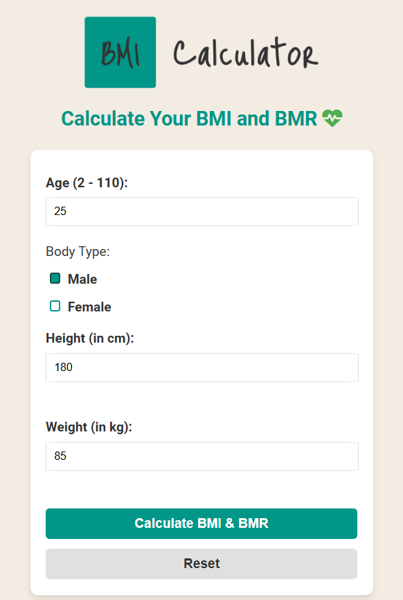
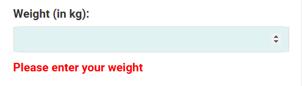
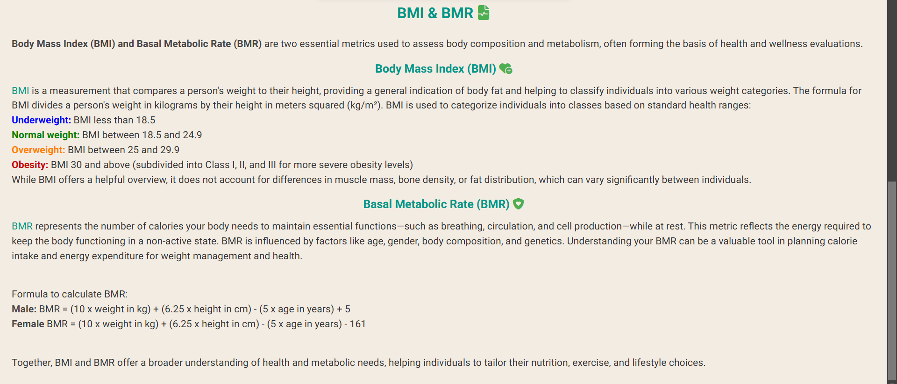

# BMI Calculator

[view the full project here](https://taz1003.github.io/PP2-BMI-Calculator/)

The BMI Calculator is an interactive and responsive webpage that enables users to calculate their Body Mass Index (BMI) and Basal Metabolic Rate (BMR). It provides valuable insights into body composition and metabolism, helping users make informed decisions about their health and fitness goals.

This site aims to showcase how pure JavaScript operates in a real-world context. It is targeted toward individuals who are interested in implementing more advanced JavaScript concepts in relation to HTML and CSS and also have a passion for fitness. The BMI Calculator is a fully responsive, JavaScript-based website allowing users to assess their fitness levels and understand the daily calorie intake required to maintain weight.

## Features

- __Information Input Form__
    - Information about user which are required to calculate BMI, BMI category and BMR : 
        - Age
        - Body-type
        - Height 
        - Weight 
    - Gender selection via radio buttons.
    - Calculate BMI & BMR button to initiate calculation (Users can also press "Enter").
    - Dedicated Reset button.

    

- __BMI Calculator__
    - Determines your BMI using your weight and height.
    - Categorizes BMI into the following classes:
        - Underweight: BMI < 18.5 - (displayed in Blue)
        - Normal weight: BMI 18.5–24.9 - (displayed in Green)
        - Overweight: BMI 25–29.9 - (displayed in orange)
        - Obesity: BMI ≥ 30 - (displayed in Red)

- __BMR Calculator__
    - Estimates daily calorie needs to maintain essential bodily functions based on all the information of the user.

- __Result Area__
    - Shows the result of user's BMI calculation.
    - Shows what BMI category the user falls under.

    

- __User-Friendly Interface__
    - Error Handling:
        - Real-time error messages for invalid or missing inputs.
        - Clear and concise feedback for user guidance.
    
    

    

    

    

    

    

    

- __Necessary information about BMI & BMR__
    - Informs about the definitions of BMI and BMR.
    - Descriptions about their correlation with fitness.
    - Shows different BMI categories.
    - Shows the formulas to calculate BMI and BMR.

    

- __Accessibility__
    - Includes ARIA labels for assistive technologies.
    - Keyboard functionality for easier navigation.

- __Responsive Design__
    - Optimized for various screen sizes (desktop, tablet, and mobile).
    - Clean and modern UI for better user experience.

## How to Use
The users should perform following steps to calculate their BMI & BMR :
- Enter their age, height (in cm), and weight (in kg).
- Select their body type (male or female).
- Click on the Calculate BMI & BMR button or press "Enter" on keyboard.
- View their calculated BMI, BMI category, and BMR in the results section.
- Use the Reset button to clear all inputs and start over.

## Features Left to Implement
- Add an option to calculate calorie needs for specific activity levels.
- Support for different measurement units (e.g. imperial system).
- Integration with fitness tracking APIs for personalized recommendations.
- More formulas (eg. Harris-Benedict Equation) for calculating BMR.
- More animations to make the webpage more lively.

## Technologies Used
- __Languages Used__
    - HTML5
    - CSS3
        - Media queries were used to enable the responsiveness of the website for various screen sizes (480px, 768px)
    - Javascript

- __Programmes & Libraries Used__
    1. __Chrome DevTools__
        - The built-in DevTools programme in the Chrome internet browser was used throughout the project to assist with        
    responsiveness and styling of the website.
    2. __[Google Fonts](https://fonts.google.com/?preview.text=Welcome%20To%20Talent%20Knox!)__
        - Google Fonts were used to import the fonts 'Roboto' and 'Lato'.
    3. __[Font Awesome](https://fontawesome.com/)__
        - Font Awesome kit was used on all pages to add icons for aesthetic and UX purposes. The favicon was also created using this website.
    4. __[Gitpod](https://www.gitpod.io/)__
        - All the coding was done using Gitpod, also the terminal was used to commit to git and push to GitHub.
    5. __[GitHub](https://github.com/)__
        - GitHub was used to store all the coding after being pushed from Gitpod.
    6. __[W3C Markup Validation Service](https://validator.w3.org/#validate_by_input) & [W3 Jigsaw CSS Validator](https://jigsaw.w3.org/css-validator/)__
        - W3C Markup Validator and W3 Jigsaw CSS Validator were used to test and validate the HTML and CSS coding of all the pages and their styles.
    7. __[Javascript Validation Service](https://jshint.com/)__
        - Js Hint validation service was used to test and validate the javascript codes.
    8. __[Grammarly](https://app.grammarly.com/)__
        - Grammarly extension was used in grammar and spell-checking as well as improving all the descriptive content of the website.

## Testing
- I tested that this website works perfectly in different browsers such as Chrome, Firefox, Opera GX, Edge, etc.
- I confirmed that the webpage is responsive.

- __Validator Testing__
    - [W3C Markup Validator](https://validator.w3.org/#validate_by_input)
        - After running the code present in index.html through the W3C Markup Validator, no errors were found.
    - [W3 Jigsaw CSS Validator](https://jigsaw.w3.org/css-validator/)
        - No errors or issues were returned after running the code present in the style.css file through the W3 Jigsaw CSS Validator.
    - [Javascript Validation Service](https://jshint.com/)
        - No errors were returned after the code present in script.js was run through jshint javascript validator. However some warnings are shown which do not affect the functionality and usabilty of the webpage whatsoever.
    - Lighthouse
        - I confirmed that the colors and fonts used in this website are easy to read and accessible by running this page through Lighthouse in Chrome DevTools.

    

- __Bugs Fixed__
    - In script.js :
        - Added (id = "calculate-button") to make sure the eventListener for the calculate button was working. Wasnt working with just class name. (lines 4)
        - Wasnt able to get BMI value, was getting NaN. Fixed it after some research online. Learned to add arguments to pass them into broader scope as parameters. (line 90)
        - During form validation, the code was continuing even after the first alert message was shown. Added "return" to ensure the discontinuation. (lines 37-58)

## Deployment
  - The website was deployed to Github. The steps to deploy are as follows:
    - Login to [Github](https://www.gitpod.io/) and locate the targeted repository from the repositories menu.
    - Navigate to the settings tab and locate the 'Pages' tab.
    - Under Build and Deployment section, change the Branch from 'none' to 'main'.
    - Refresh the page (if not automatically refreshed) and navigate back to the Code tab.
    - At the right side, in the Deployments section, click on github-pages and the published link will be presented there.
 
  View the live website link here - [BMI Calculator](https://taz1003.github.io/PP2-BMI-Calculator/)

## Credits
- In script.js, the error message function (lines 68 - 72) was created after a good amount research on Youtube. The video that mainly helped is - [Creating Custom Errors in JavaScript](https://www.youtube.com/watch?v=cVo186hyYsM&ab_channel=dcode).
- In script.js, the for..of looping of arrays (lines 79 - 84) was inspired after some research on Google and Youtube. The video that helped the most is: [For of Loop with an Array in JavaScript](https://www.youtube.com/watch?v=c69Y2GpF6-U&ab_channel=Telusko).
- The code to wait for the DOM content to finish loading was taken from the [CI Love Maths project](https://taz1003.github.io/love-maths/).
- The [MDN Web Docs](https://developer.mozilla.org/en-US/docs/Web/JavaScript/Reference/Global_Objects/Array) website was extremely helpful in creating the code found in script.js.

- __Content and Design__
    - All descriptive content was written with comprehensive support from [Grammarly](https://app.grammarly.com/) extension.
    - The webpage was designed using [MockFlow Wireframe](https://wireframepro.mockflow.com/).
    - The color palette used in the website was generated using [ColorSpace](https://mycolor.space/) palette generator.

- __Acknowledgements__
    - My Mentor for the continuous helpful feedback.
    - The Code Institute Tutor Support for their support.